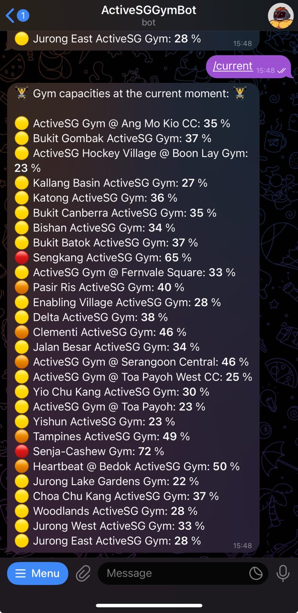
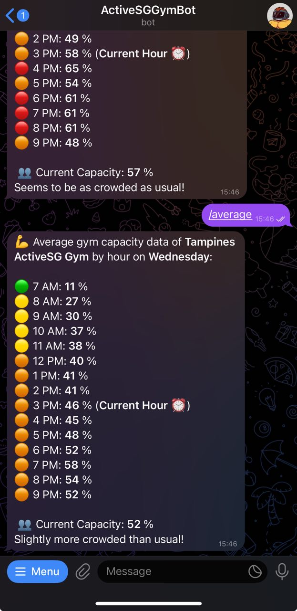

# ActiveSG Gym Bot 💪🤖

## About the Project

The **GymBot** helps users monitor current gym capacity and analyze average gym crowd trends over time. Designed as a telegram bot, it provides a convenient way for users to plan gym visits based on the live capacities as well as historical average trends.

Key Features:
- 📊 View current gym capacity at a glance
- 📈 Analyze average gym usage trends
- 🌐 All with quick easy commands through the telegram bot

## Screenshots

|Current Capacity   |Average Crowd Trends   |
|-------------------|---------------|
||

## Accessing the Bot

## Accessing the Bot

The ActiveSG GymBot can be accessed through Telegram [here](https://t.me/activeSG_gym_bot).

Alternatively, scan the QR code below:

Example Commands:
- `/current` - View current gym capacities.
- `/average` - Check average gym crowd trends.

---

## 🛠️ Technical Details

### Gym Capacity Tracker

All gym capacity data is retrieved from the [ActiveSG Gym Capacity website](https://activesg.gov.sg/gym-capacity).

**How It Works**:
- **Script**: The data retrieval is handled by `GymDataTracker.py`, which is run from `main.py`.
- **Schedule**: This script is executed on the 15th minute of every hour as a Cloud Run job.
- **Data Storage**: The retrieved data is stored in a **Supabase** database and managed by `GymDataManager.py`. Entries stored for more than 2 months is removed to ensure up-to-date data.

### GymBot

The bot is responsible for user interactions via Telegram and is built using the Telegram Bot API.

**Key Components**:
- **Telegram API & Bot Logic**: Managed by `GymBot.py`.
- **Response Handling**: Text and inline keyboard responses are processed in `QueryHandler.py`.

**Average Capacity Retrieval**:
- When users request average gym capacity, `GymDataManager.py` makes an **RPC call** to the Supabase database.
- A **SQL query** is executed on the database to calculate and return the required average data.

### Database Workflow
1. **Data Ingestion**:
   - Real-time capacity data fetched by `GymDataTracker.py` is stored in the database.
2. **Data Querying**:
   - Historical and average data is fetched using custom SQL queries made via the Supabase RPC interface.
